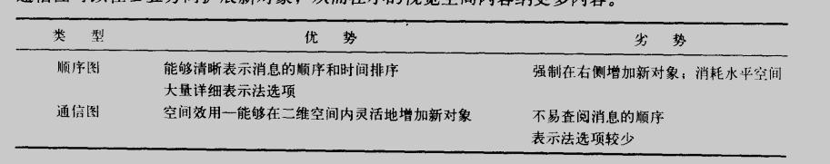
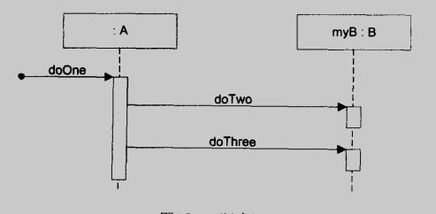
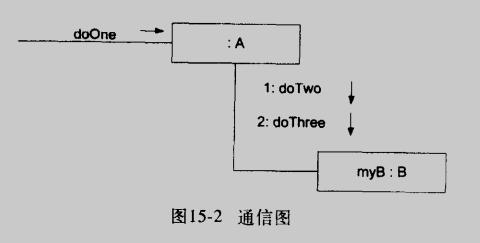
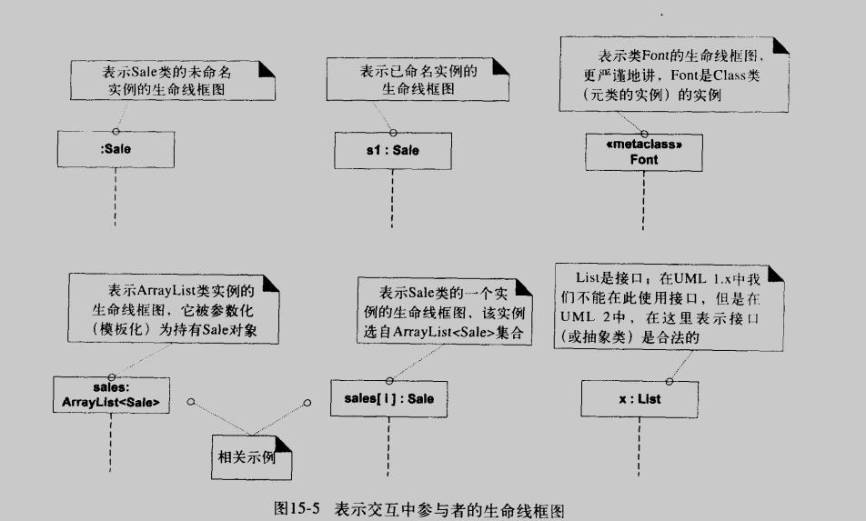
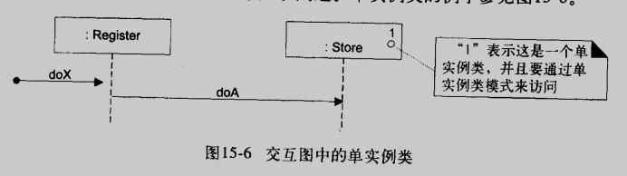
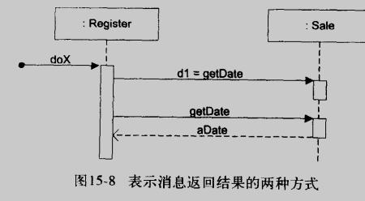
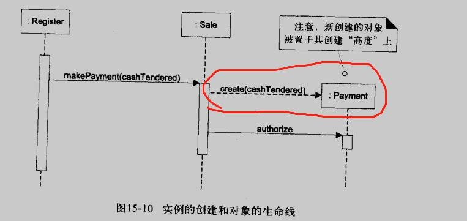
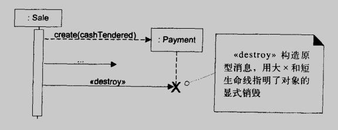
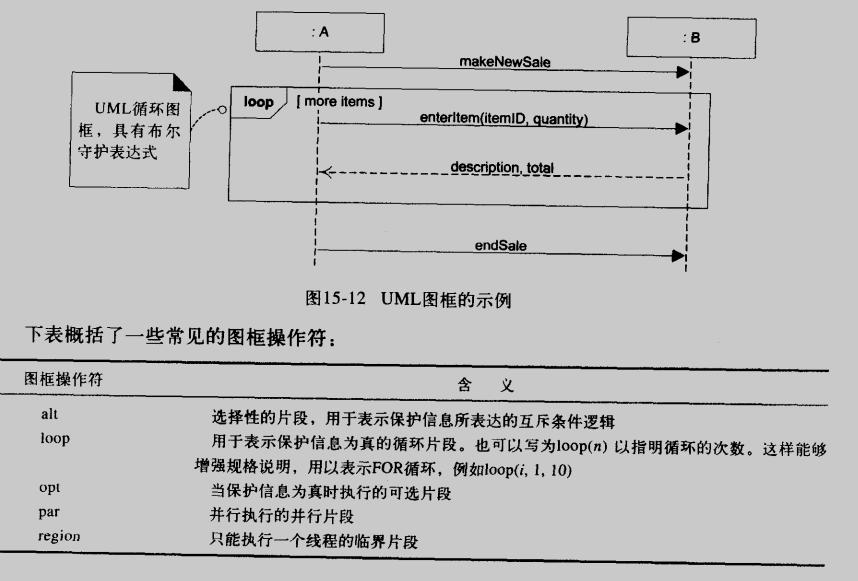
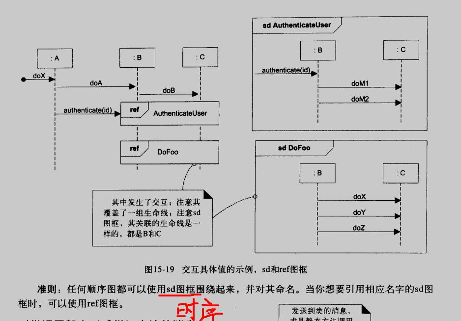

# UML交互图

## 交互图
交互图, interaction diagram, 描述对象间通过消息的交互, 用户动态对象建模  
交互图可分为: 顺序图 sequence diagram, 通信图 communication diagram

## 常用的交互图表示法

### 使用生命线框图表示参与者
生命线 lifeline 框图表示交互的参与者, 不一定是类的实例, 还可以是静态类(元类的实例)  

### 消息表达式的基本语法
return = message(parameter: paramterType): returnType  
没有参数时可以省略圆括号  

## 顺序图的基本表示法
### 生命线框图和生命线
生命线: 生命线看框图之下的垂直延伸线, 可以是实线或者虚线  
生命线自上而下表示时间顺序  

### 消息
消息: 在垂直生命线之间, 用带实心箭头的实线并附以消息表达式表示对象间的每个消息

### 控制期与执行规格条
控制期: focus of control, 在常规阻塞调用中, 将操作置于调用堆栈中  
执行规格条(活动条): execution specification bar, 表示控制期

### 表示应答或返回
两种方法表示消息的返回结果:
1. 使用消息语法 returnVar = message(parameter)
2. 在活动条末端使用应答(或返回)消息线

### 发送给自身的消息
使用嵌套的活动条表示

### 实例的创建
使用虚线, 消息名称可带 create, 新创建的对象要置于其创建的"高度"上

### 对象的销毁
可显式表示对象的销毁

### 图框
图框: frame, 是图的区域或片段, 具有操作符或标签和保护信息  
支持循环, 有条件的消息, 互斥的有条件消息, 对集合的迭代, 图框嵌套

### 交互图的关联
交互具体值(interaction occurrence, 又称 交互使用 interaction use), 表示在交互中引用另一交互
