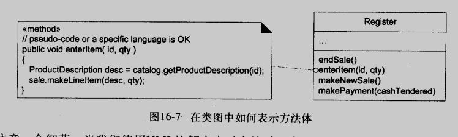

# UML类图

## 概念

### UML类图(class diagram)
UML类图(class diagram)表示类, 接口及其关联  
类图用于静态对象建模  

### 类元(classifier)
类元是 描述行为和结构特性的模型元素  
在类图中, 最常用的类元是类和接口

### 表示属性的方式: 属性文本和关联线
属性文本表示法: 属性文本的完整格式: `visibility name: type [multiplicity] = default {property-string}`
关联线表示法: 导航性箭头由源对象指向目标对象; 多重性放置在目标的一侧; 角色名放置目标一侧, 表示属性名称

关联端点可以表示: 属性名称, 多重性, 特性字符串(如: ordered, Lisk, unique)

### 注解符号(note symbol)
褶角矩形, 使用虚线连接到注解的元素上  
可以表示: 
1. 注解或注释
2. 约束
3. 方法体

### 操作和方法
完整的操作语句:
`visibility name (parameter-list): return-type {property-string}`
`visibility name (parameter-list) {property-string}`  
(注意: UML2没有包括返回类型元素)

操作不是方法, UML操作是声明, 方法是实现  
1. 交互图中, 可以通过消息的细节和顺序来表示
2. 类图中, 可以用构造型为`<<method>>`的注解符号来表示 (方法体为静态类图增加了动态元素, 混合了动态视图和静态视图)

### 关键字
关键字是对模型元素分类的文本修饰: `<<actor>> <<interface>> {abstract} {ordered}`
(p.s. <<>> 在 UML1 中仅用于表示构造型, UML2 既可以用于构造型又可以用于关键字)

### 构造型, 简档和标记
简档(profile): 一组相关构造型, 标记和约束的集合, 目的是使用 UML 专用于特定领域或平台
构造型(stereotype): 表示对现有建模概念的精化
