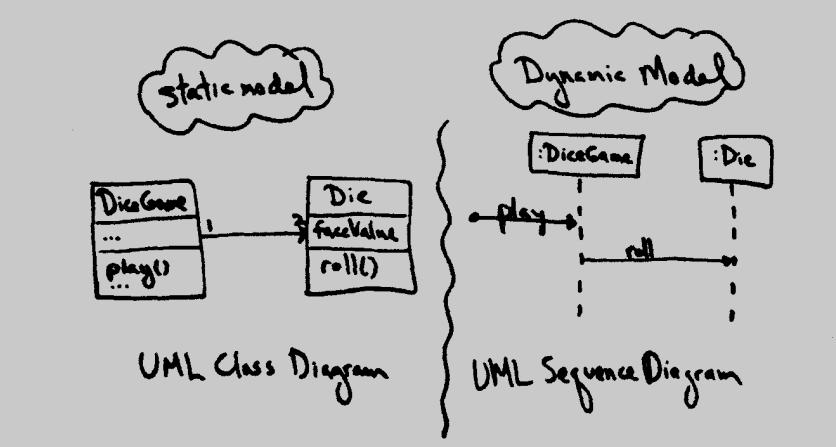

# 迈向对象设计

### 如何设计对象
1. 编码
2. 绘图, 然后设计
3. 逆向工程(对类图或交互图进行逆向工程)

### 设计对象
对象模型有两种类型: 动态, 静态; 二者可以并行创建: 花费简短时间动态, 然后转到静态, 交替进行
动态对象建模: 交互图(顺序图或通信图)
静态对象建模: UML类图

### 对象设计 v.s. UML表示法
绘制UML只是反映了对设计作出的决策; 对象设计不一定需要UML  

对象设计的关键:
1. 职责分配原则
2. 设计模式

