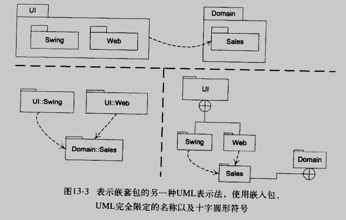
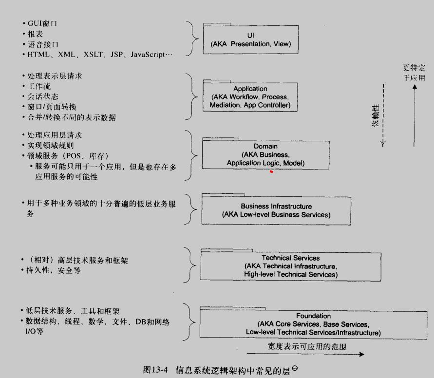
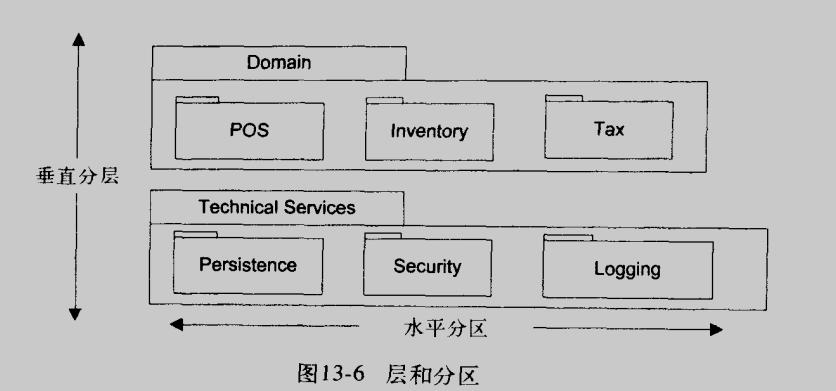

# 逻辑架构和 UML 包图

## 逻辑架构

### 逻辑架构
> LA == logical architecture == 逻辑架构
软件宏观组织结构, 将软件类组织为 包, 命名空间, 子系统, 层, 等

### 层
> layer == 层
对 类, 包, 子系统 的甚为粗粒度的分组  
较高层可以调用较低层; 在严格的分层架构中, 层只能调用与其相邻的下层的服务  

OO系统中通常包括:
1. 用户界面
2. 应用逻辑和领域对象
3. 技术服务

### 包图
UML包能够组织任何事物; 通过有箭头的虚线显示包之间的依赖性
UML包代表命名空间

### 使用层进行设计的准测: 内聚职责; 使关系分离
信息系统逻辑架构中常见的层:
1. UI (AKA Presentation, View)
2. Application (AKA Workflow, Process, Mediation, App Controller)
3. Domain (AKA Business, Application Logic, Model)
4. Business Infrastructure (AKA Low-level Business Services)
5. Technical Services (AKA Technical Infrastructure, High-level Technical Services)
6. Foudation (AKA Core Services, Base Services, Low-level Technical Services/Infrastructure)

### 层和分区
层: 对系统在垂直方向的划分
分区: 对层在水平方向进行划分, 形成相对平行的子系统

### 模型-视图分离原则
模型(领域)对象不应该**直接**与视图(UI)对象连接  
观察者模式是对此原则的合理拓展