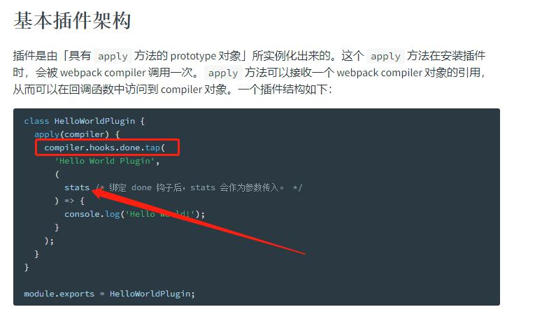
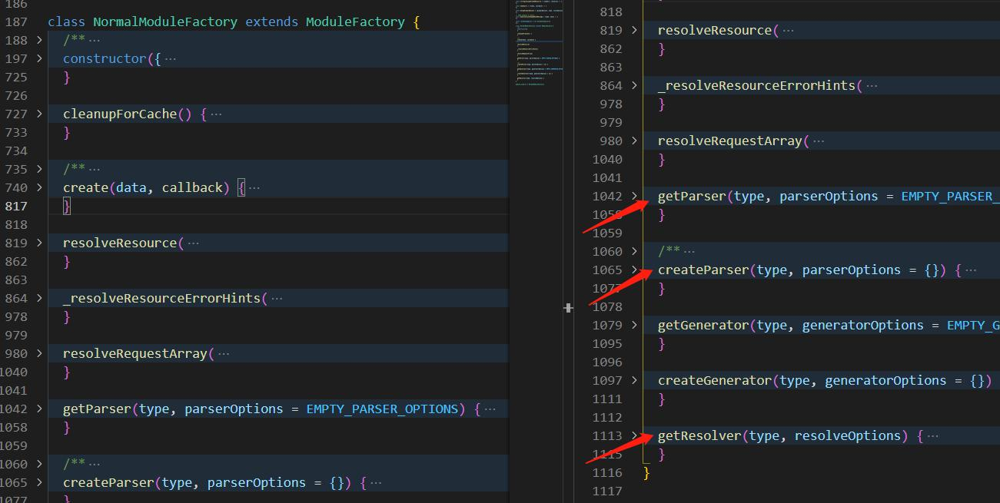

# webpack 插件机制 - 一切皆插件

## 1 tapable
tapable 是什么?
1. 是一种发布订阅的模式
2. 是一个流水线
3. 是一个有多种风格的流水线 (多种钩子)
4. 是 webpack 插件机制的心脏

是一种发布订阅的模式
``` js
// tapable 实例 (钩子)
const hook = new SyncHook(['arg1', 'arg2']);

// register 订阅
hook.tap('flag1', (arg1, arg2) => {
  console.log('flag1:', arg1, arg2);
});

// call 发布
hook.call('hello', 'world');
```

是一个流水线
``` js
const hook = new SyncHook(['arg1', 'arg2']);

// 做第一件事情
hook.tap('flag1', (arg1, arg2) => {
  console.log('flag1:', arg1, arg2);
});

// 做第二件事情
hook.tap('flag2', (arg1, arg2) => {
  console.log('flag2:', arg1, arg2);
});

// 还可以做更多事情
// ....

hook.call('hello', 'world');
```

是一个有多种风格的流水线 (多种钩子)
1. 同步钩子 SyncHook
2. 保险钩子 SyncBailHook
3. 异步串联钩子 AsyncSeriesHook


是 webpack 插件机制的心脏

## 2 一切皆插件: ppt & source code
> v4.41.5 && v5.74.0
webpack 关键的 tapalbe 实例
其中的 compiler 是最主要的, 插件就是对 compiler 对象的一系列操作
1. compiler aka 老大
2. compilation aka 依赖图
3. resolver aka 老马
4. moduleFactories 生成模块对象
5. parser 生成AST
6. template 渲染

### compiler
file: Compiler, lib\Compiler.js

compiler 上面的钩子




compiler 上面有其他重要的 tapable 实例
``` js
// ResolverFactory line 146
this.resolverFactory = new ResolverFactory();

// NormalModuleFactory line 636~641
const normalModuleFactory = new NormalModuleFactory(/*xxx*/);
this.hooks.normalModuleFactory.call(normalModuleFactory);
```

### compilation
> 待 part 3 依赖图 & ESM 详解
file: Compilation, lib\Compilation.js

### resolver
file: ResolverFactory, lib\ResolverFactory.js

### moduleFactories
file: NormalModuleFactory, ContextModuleFactory, DllModuleFactory, MultiModuleFactory




### parser
file: Parser && JavascriptModulesPlugin

### template
file: ModuleTemplate, lib\ModuleTemplate.js

## 3 依赖图
1. compilation 对象就是依赖图
2. buildMeta.providedExports: FlagDependencyExportsPlugin
3. usedExports: FlagDependencyUsagePlugin
4. 时机: compiler.hooks.done


### compilation 对象就是依赖图


### FlagDependencyExportsPlugin & FlagDependencyUsagePlugin

lib\FlagDependencyUsagePlugin.js
``` js
// line91 当前的模块C用到模块R的导出, 就把这个 importedNames 记录在模块R的 usedExports 之中
processModule(referenceModule, importedNames);

// line38 processModule
module.usedExports = addToSet(module.usedExports || [], usedExports);
```


lib\FlagDependencyExportsPlugin.js
``` js
// line49 processDependency (准确来说, 应该叫 processExports)
const exportDesc = dep.getExports && dep.getExports();
const exports = exportDesc.exports;
addToSet(moduleProvidedExports, exports)

// line122 主程序
module.buildMeta.providedExports = Array.from(moduleProvidedExports);
```

### compiler.hooks.done

官网文档说明


源码中一处被调用的地方


sync => async


## 3 依赖图(webpack5)
1. compilation 对象就是依赖图
2. compilation.moduleGraph.getExportsInfo(module) => exportsInfo

### 术语
ModuleGraphModule: ModuleGraph.prototype._moduleMap 的成员
ModuleGraphConnection: ModuleGraph.prototype._dependencyMap 的成员
ExportsInfo: getProvidedExports, getUsedExports
ExportInfo: ExportsInfo.exports 的成员, 具有 getUsedInfo(), _usedInRuntime, _globalUsed
runtime??
HarmonyExportInitFragment: 模板生成的地方
getUsedName 若为 false, 则不写入 `__webpack_require__.d`(HarmonyExportSpecifierDependency 调用 exportsInfo, exportsInfo 又调用 exportInfo)
block 的概念要理清
HarmonyImportSpecifierDependency 就是 `import { xxx } from './xxx.js';`
HarmonyExportSpecifierDependency 就是 `export const xx = abc`


### FlagDependencyUsagePlugin
1. processEntryDependency => processReferencedModule
2. processModule
3. setUsed 设置了 _globalUsed, _usedInRuntime
4. ModuleGraph.prototype.getUsedExports 有真正的含义
5. 通过 ModuleGraph.prototype.getUsedExports/getProvidedExports 能够满足需求, 等价于 ExportsInfo.prototype.getUsedExports/getProvidedExports
6. getUsedExports 是通过 exportInfo.getUsed 与 UsageState 枚举判断而得的
7. getUsed 的值是由 setUsed 来设置的, setUsed 由 setUsedWithoutInfo, setUsedWithoutInfo, setAllKnownExportsUsed 调用, 这些函数在 FlagDependencyUsagePlugin.js 中被调用

// 再次理解
1. 调用时机: compilation.hooks.optimizeDependencies
2. 参数: modules
3. 主逻辑: 
4. 主要作用: 
5. step 1: initialize exports usage
	1. 遍历 modules, 一直追加到 exportInfoToModuleMap
	2. 初始化每个 exportInfo 的 usedInfo `exportsInfo.setHasUseInfo()`
6. step 2: trace exports usage in graph
	1. 从 compilation.entries / compilation.globalEntry 出发, 根据 runtime 处理入口依赖 `processEntryDependency(dep, runtime)`
		1. 根据 entryDependency 找到 module (这个 module 就是真正的入口 module), 调用 `processReferencedModule(module, NO_EXPORTS_REFERENCED, runtime, true)`
			1. 入口的 EntryData 类型是特殊的, 不是 Module; 它的 dependencies 的成员也是入口特有的 EntryDependency
			2. moduleGraph.getModule 牵扯到 ModuleGraphConnection
			3. usedExports = NO_EXPORTS_REFERENCED 是否合理? 入口导出东西会不会被别人用到?
			4. forceSideEffects = true 是合理的, 因为入口就是有副作用的
	2. 处理队列中的模块 `processModule(module, runtime, false)`
		1. 遍历局部的 queue, 对于每一个 block
			1. 进行遍历 block.blocks
				1. 入队 queue, 用作维护嵌套 module(as AsyncDependenciesBlock) 广度优先遍历
			2. 进行遍历 block.dependencise
				1. 对于每个 dep, 获得当前 runtime 下的 referencedExports (即这个 dep 的元信息里面的 id)
					1. 从结果上看, 这个 referencedExports 一般来说和 dep.name 是相同的, 除非改了名, 是字符串或者一个带 name 的 ReferencedExport
					2. 从实现上看, 具体的 dependency 有自己的实现, 比如 HarmonyImportSpecifierDependency:
						1. 调用 `dep.getReferencedExports()`
						2. 间接调用 `dep.getIds()`
						3. 间接调用 `moduleGraph.getMetaIfExisting(dep)`
				2. 对于每个 dep, 通过获取 connection 获取到 module, 将其存入 map // 事实上, 已经知道了一个 module 的 usedExports 了, 就差设置 flag
		2. 维护局部的 map, 对于每一个 [module, referencedExports], 调用 `processReferencedModule(module, referencedExports)`
	3. processReferencedModule
		1. 间接调用了 exportInfo 的 setUsed & setUsedConditionally
		2. 维护 queue, 以便未处理的模块回炉
		3. 通过 exportInfoToModuleMap 通过 exportsInfo 反查到 module

### FlagDependencyExportsPlugin
1. 多种类型的依赖有对应的 getExports 方法, 但这个方法只返回了一个带 exported names(key 为 exports) 的结构 (exportDesc)
2. getProvidedExports 获取 _exports 的项 (exportInfo) 的 name
3. FlagDependencyExportsPlugin 调用了 ExportsInfo.prototype.restoreProvided
4. restoreProvided 调用了 this.getExportInfo (实际上没有会先set), 这样 this._exports 就收集了 providedExports

// 再次理解
1. 调用时机: compilation.hooks.finishModules
2. 参数: modules
3. 主逻辑: 调用了 neo-async 的 each()
4. 主要作用是将 module 的 dependencies 转化为 ExportsInfo
	1. 通过 exportsInfo.getExportInfo 初始化单个 exportInfo
	2. 通过改写单个 exportInfo.provided 属性为 true 标记为导出
5. asyncLib.each 的第2个参数: iterator
	1. 获取每个 module 的 exportsInfo
	2. 根据情况调用 `exportsInfo.setHasProvideInfo()`
	3. module 入队
6. asyncLib.each 的第三个参数 // 将 module 的 dependencies 转化为 ExportsInfo
	1. 当 queue 不为空, module 出队, 
	2. 给 exportsInfo 赋值为当前出队的 module 的 exprotsInfo
	3. 清空当前的 exportsSpecsFromDependencies
	4. 执行 `processDependenciesBlock(module)` // 维护 exportsSpecsFromDependencies
		1. 遍历 depBlock.dependencies, 执行 `processDependency(dep)`
			1. 维护 exportsSpecsFromDependencies `exportsSpecsFromDependencies.set(dep, dep.getExports(moduleGraph?) as ExportsSpecs)` // 能入队的基本就是导出了, 需要进一步转为 exportsInfo
			2. 注意, 并不是所有的 dependecy 都有有意义的 getExports 方法, 如 Harmony**Export**SpecifierDependency 是有的, 但 Harmony**Import**SpecifierDependency 会返回 undefined
		2. 遍历 depBlock.blocks, 执行 `processDependenciesBlock(block)` // 深度优先遍历
	3. 遍历 exportsSpecsFromDependencies, 执行 `processExportsSpec(dep, exportsSpec)`
		1. 对于 unknown epxorts (exportDesc.exports === true)
		2. 对于 exportDesc.exports 为数组
			1. 调用了当前的 module 的 `exportsInfo.getExportInfo(name)`, 没初始化会初始化 exportInfo
			2. 维护 exportInfo.provided


## 4 Tree Shaking
### webpack 怎么去掉无用依赖的, 即 webpack 怎么实现 tree-shaking
1. 依赖图的建立已经剔除了未使用的文件
2. 识别到 usedExports 就可以剔除未使用的导出

### webpack 无法 tree-shaking 的原因
1. 表层原因: usedExports & providedExports 无法正常生成
2. 根因: [tree-shaking-like-a-pro](https://bluepnume.medium.com/javascript-tree-shaking-like-a-pro-7bf96e139eb7#43e1)

## 5 Concept
### Chunk
用于组织输出结构的对象
A Chunk is a unit of encapsulation for Modules.
Chunks are "rendered" into bundles that get emitted when the build completes.
### Module
资源在 webpack 内部的映射对象，包含了资源的路径、上下文、依赖、内容等信息
### Dependency
Any time one file depends on another, webpack treats this as a dependency.
### ModuleGraph
记录 Dependency Graph 信息的容器
一方面保存了构建过程中涉及到的所有 module 、dependency 对象，以及这些对象互相之间的引用
另一方面提供了各种工具方法，方便使用者迅速读取出 module 或 dependency 附加的信息
### ModuleGraphConnection
记录模块间引用关系的数据结构
内部通过 originModule 属性记录引用关系中的父模块
通过 module 属性记录子模块
### ModuleGraphModule
Module 对象在 Dependency Graph 体系下的补充信息
包含模块对象的 incomingConnections —— 指向模块本身的 ModuleGraphConnection 集合，即谁引用了模块自己
outgoingConnections —— 该模块对外的依赖，即该模块引用了其他那些模块。
