# webpack 插件机制 - 一切皆插件

## 1 tapable

tapable 是什么?

1. 是一种发布订阅的模式
2. 是一个流水线
3. 是一个有多种风格的流水线 (多种钩子)
4. 是 webpack 插件机制的心脏

是一种发布订阅的模式

```js
// tapable 实例 (钩子)
const hook = new SyncHook(['arg1', 'arg2']);

// register 订阅
hook.tap('flag1', (arg1, arg2) => {
  console.log('flag1:', arg1, arg2);
});

// call 发布
hook.call('hello', 'world');
```

是一个流水线

```js
const hook = new SyncHook(['arg1', 'arg2']);

// 做第一件事情
hook.tap('flag1', (arg1, arg2) => {
  console.log('flag1:', arg1, arg2);
});

// 做第二件事情
hook.tap('flag2', (arg1, arg2) => {
  console.log('flag2:', arg1, arg2);
});

// 还可以做更多事情
// ....

hook.call('hello', 'world');
```

是一个有多种风格的流水线 (多种钩子)

1. 同步钩子 SyncHook
2. 保险钩子 SyncBailHook
3. 异步串联钩子 AsyncSeriesHook


是 webpack 插件机制的心脏

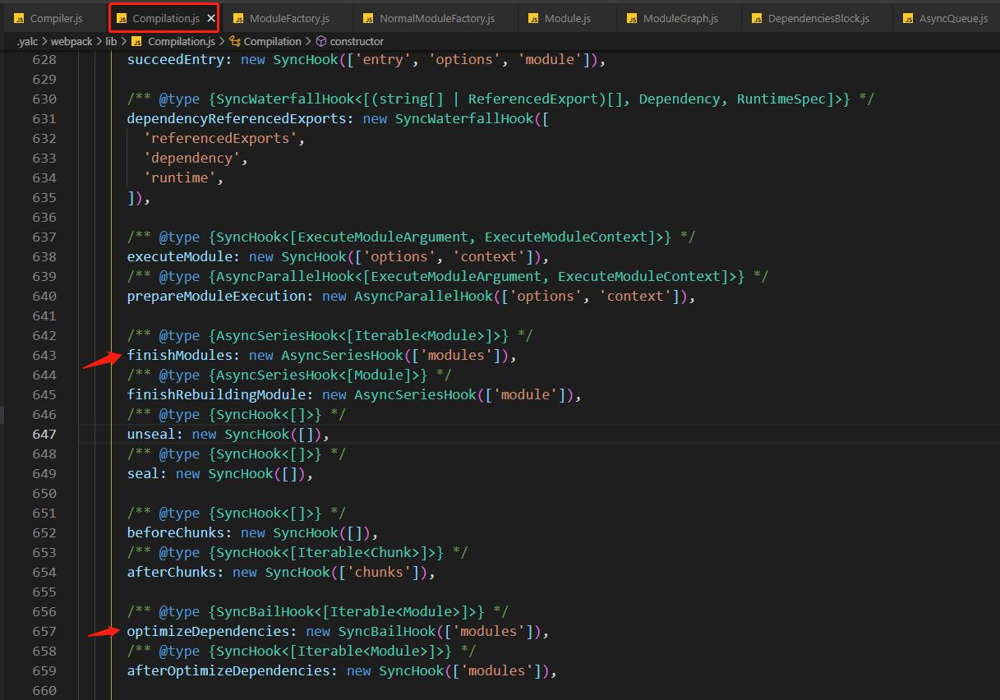

> 我们可以猜测, 在适当的时候, webpack 的这些核心对象就会调用这些钩子发布事件; 这时候就可以 "插入" 插件了(去获取重要的信息, 或者去修改 webpack 的制品)

官网例子  
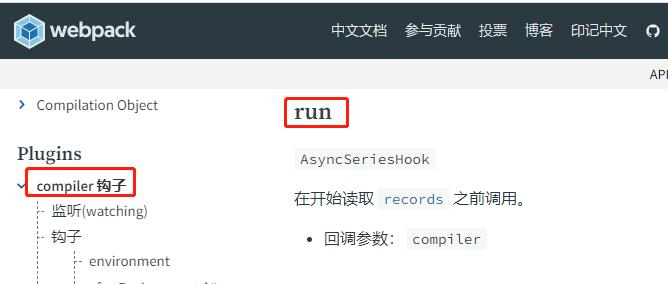

> compiler 对象有 run 这个钩子

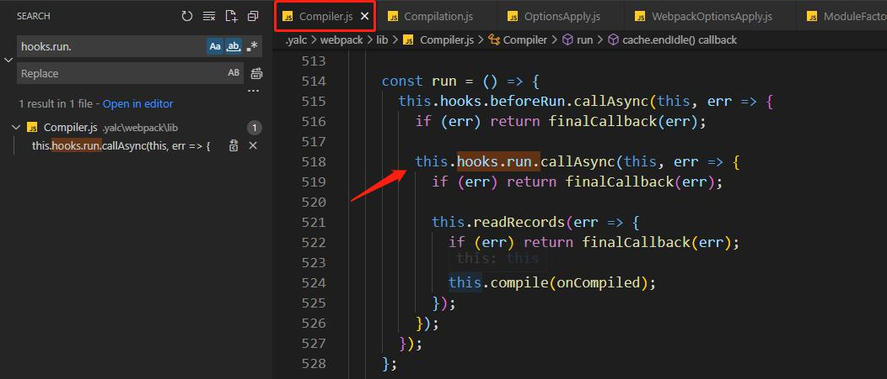

> 源码中, 在调用 run 方法的时候确实发布了 run

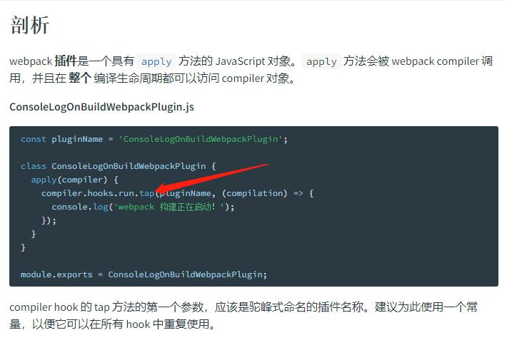

> 在特定的时机发布事件, 插件逻辑就能在这个合适的时机执行, 并且能够访问这个时机的关键产物

## 2 一切皆插件: ppt & source code

注意, 新版的 webpack 的关键对象已经不是 tapalbe 实例了  
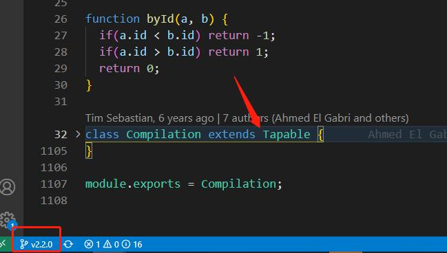
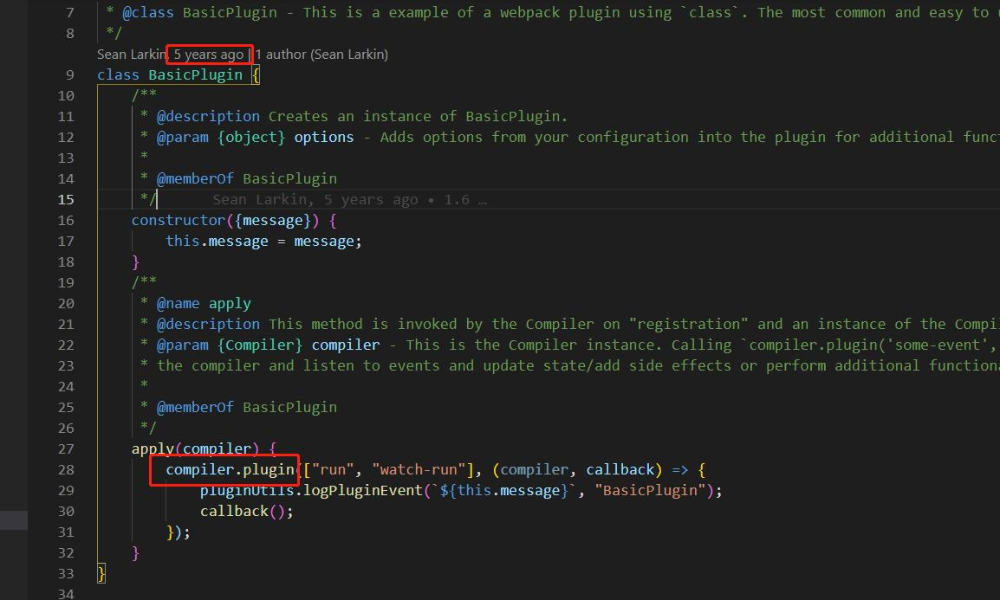

webpack 关键的 tapalbe 实例
其中的 compiler 是最主要的, 插件就是对 compiler 对象的一系列操作

1. compiler 核心分发器
2. compilation 依赖图
3. resolver 找资源
4. moduleFactories 生成模块对象
5. parser 生成 AST
6. template 渲染

### compiler 核心分发器

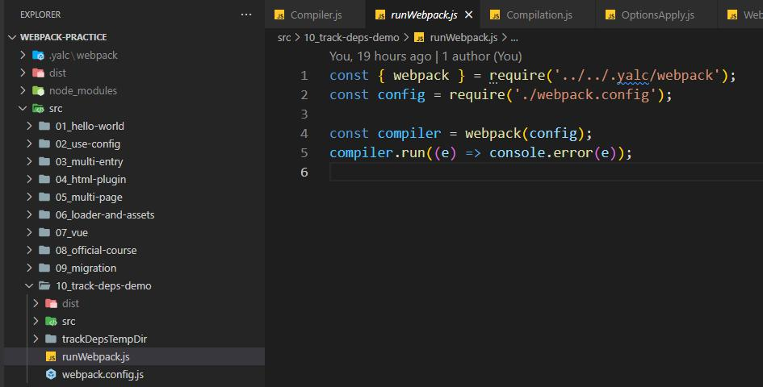

以 hooks.done 为例


### compilation

使用 依赖图遍历算法(dep graph traversal algo) 维护 moduleGraph

### resolver

以独立成一个 npm 包
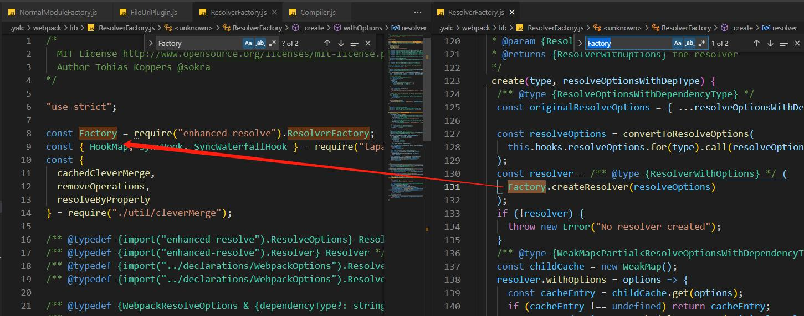
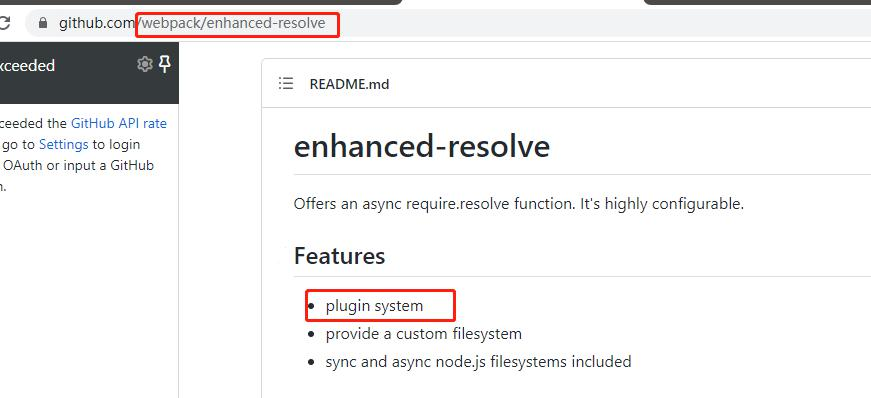

### moduleFactories

ModuleFactory 是一个抽象类, 有更具体的模块工厂, 比如 NormalModuleFactory


### parser

Parser 是一个抽象类, 具体的如 JavascriptParser

wepack 5 的 parser 聚焦于 parse AST, dep 是通过插件机制创建与收集的
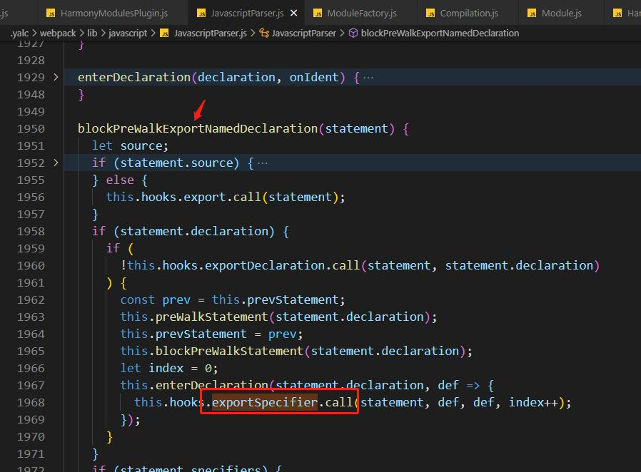


### template

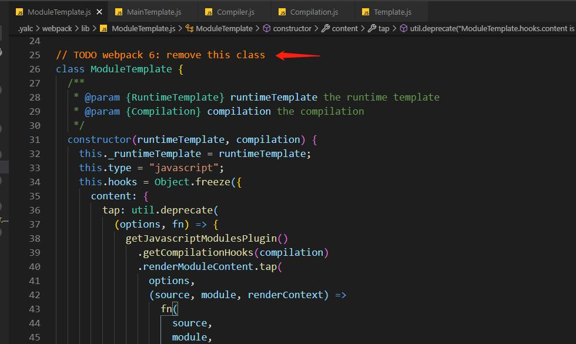
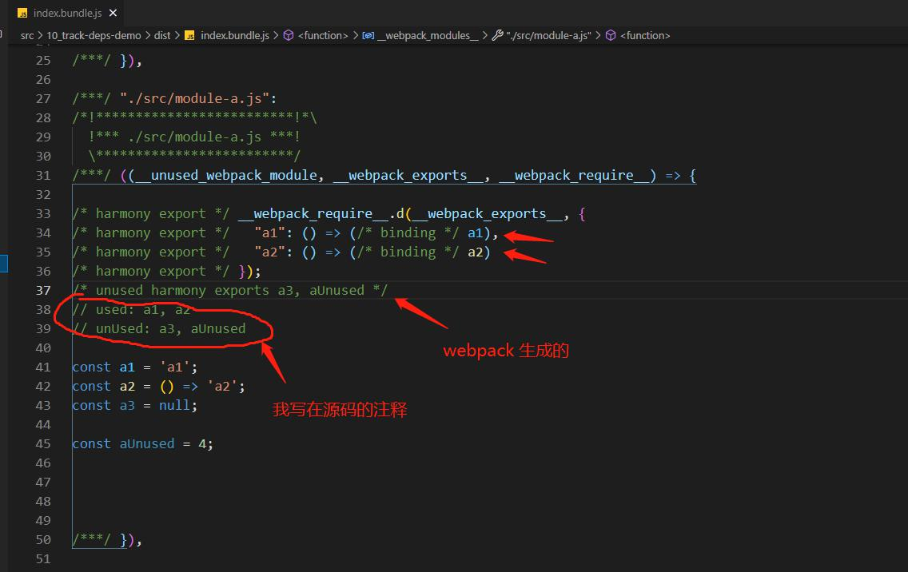
