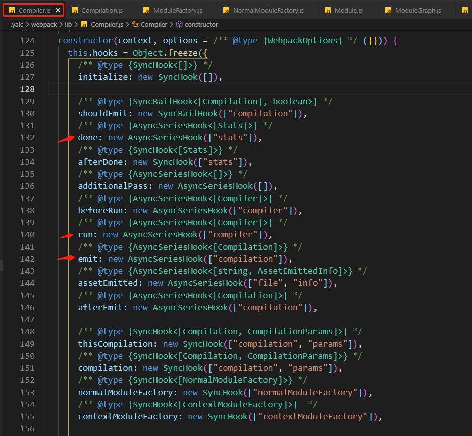
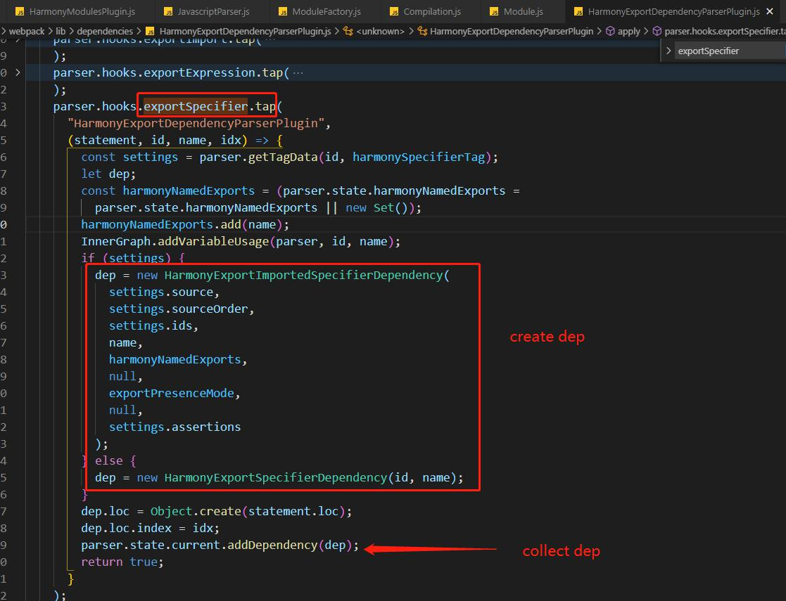

# webpack 插件机制 - 一切皆插件

## 1 tapable
tapable 是什么?
1. 是一种发布订阅的模式
2. 是一个流水线
3. 是一个有多种风格的流水线 (多种钩子)
4. 是 webpack 插件机制的心脏

是一种发布订阅的模式
``` js
// tapable 实例 (钩子)
const hook = new SyncHook(['arg1', 'arg2']);

// register 订阅
hook.tap('flag1', (arg1, arg2) => {
  console.log('flag1:', arg1, arg2);
});

// call 发布
hook.call('hello', 'world');
```

是一个流水线
``` js
const hook = new SyncHook(['arg1', 'arg2']);

// 做第一件事情
hook.tap('flag1', (arg1, arg2) => {
  console.log('flag1:', arg1, arg2);
});

// 做第二件事情
hook.tap('flag2', (arg1, arg2) => {
  console.log('flag2:', arg1, arg2);
});

// 还可以做更多事情
// ....

hook.call('hello', 'world');
```

是一个有多种风格的流水线 (多种钩子)
1. 同步钩子 SyncHook
2. 保险钩子 SyncBailHook
3. 异步串联钩子 AsyncSeriesHook


是 webpack 插件机制的心脏



官网例子


## 2 一切皆插件: ppt & source code

注意, 新版的webpack 的关键对象已经不是 tapalbe 实例了


webpack 关键的 tapalbe 实例
其中的 compiler 是最主要的, 插件就是对 compiler 对象的一系列操作
1. compiler 核心分发器
2. compilation 依赖图
3. resolver 找资源
4. moduleFactories 生成模块对象
5. parser 生成AST
6. template 渲染

### compiler 核心分发器


以 hooks.done 为例


// ! delete
compiler 上面有其他重要的 tapable 实例
``` js
// ResolverFactory line 146
this.resolverFactory = new ResolverFactory();

// NormalModuleFactory line 636~641
const normalModuleFactory = new NormalModuleFactory(/*xxx*/);
this.hooks.normalModuleFactory.call(normalModuleFactory);
```

### compilation
使用 依赖图遍历算法(dep graph traversal algo) 维护 moduleGraph

### resolver
以独立成一个 npm 包


### moduleFactories
ModuleFactory 是一个抽象类, 有更具体的模块工厂, 比如 NormalModuleFactory


### parser
Parser 是一个抽象类, 具体的如 JavascriptParser

wepack 5 的 parser 聚焦于 parse AST, dep 是通过插件机制创建与收集的



### template


