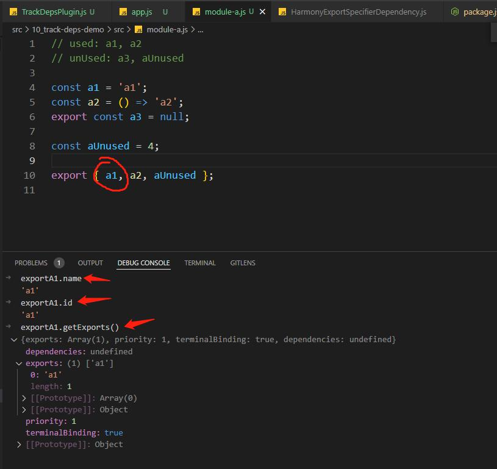
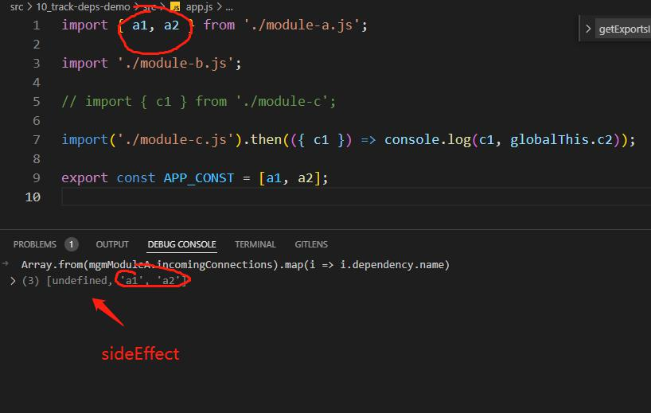

# whatIs...

## 什么是 dependenciesBlock (sometimes: module)
会被继承, 被 Module 或 AsyncDependenciesBlock 继承  

有 dependencies, blocks 属性  
dependencies 的项是 dependency
blocks 的项是 asyncDependenciesBlock

### 什么是 Module
"webpack 一切皆模块" 这个 slogan 的基本单位  

维护了与文件的映射关系: context, rawRequest  

维护自己的依赖 (继承了 dependencies, blocks 属性)  

### 什么是 dependency
某一模块的 dependencies 可以看到  

种类包括但不限于: 导入的, 导出的, 副作用

记录了自己的信息(导出与导入有差异)

> Question: Module.prototype.dependencies 包含的种类包括 导入的 & 导出的 & 副作用, 那么是怎么区分他们呢  
> tips: 这是收集 providedExports 的关键 (尽管交给了 exportsInfo 去做)

### 什么是 asyncDependenciesBlock
动态 import 进来的 dependenciesBlock  

## 什么是 moudleGraph

### 什么是 _dependencyMap
类型是 WeakMap<Dependency, ModuleGraphConnection | null>
只有 import 类型的依赖才有 ModuleGraphConnection

### 什么是 ModuleGraphConnection
ModuleGraphConnection记录了这个依赖的 引用(referencing) 与 被引用方(referenced)

> tips: 这是收集 usedExports 的关键 (尽管交给了 exportsInfo 去做)

### 什么是 _moduleMap
类型是 Map<Module, ModuleGraphModule>

### 什么是 ModuleGraphModule
moduleGraph 视觉下的 module, 给 module 提供了在 moduleGraph 下的表述  
带有字段: incomingConnections(引进的理由), outgoingConnections(引发了别的模块的引用), exports(module 的 exportsInfo)

> 看来 exportsInfo 仅仅是现有信息的"计算属性", 那到底 connection 是怎么生产出来的呢

