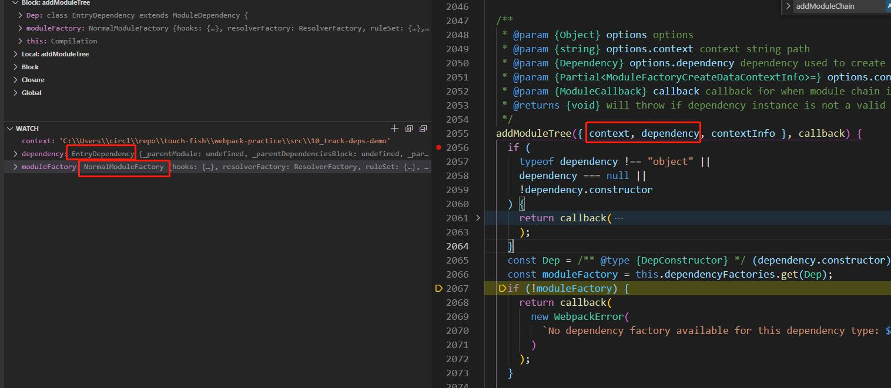

# 获取 providedExports 与 usedExports 的原理

## compilation
addEntry => _addEntryItem =>
addModuleTree =>

handleModuleCreation => factorizeModule (入队 factorizeQueue) =>

// 1
addModule (入队 addModuleQueue) =>
moduleGraph.setResolvedModule (收集上下游依赖 incomingConnections),

// 2
_handleModuleBuildAndDependencies => 
buildModule => 
processModuleDependencies (入队 processDependenciesQueue)

## the plugins

### FlagDependencyExportsPlugin
1. 调用时机: compilation.hooks.finishModules
2. 参数: modules
3. 主逻辑: 调用了 neo-async 的 each()
4. 主要作用是将 module 的 dependencies 转化为 ExportsInfo
	1. 通过 exportsInfo.getExportInfo 初始化单个 exportInfo
	2. 通过改写单个 exportInfo.provided 属性为 true 标记为导出
5. asyncLib.each 的第2个参数: iterator
	1. 获取每个 module 的 exportsInfo
	2. 根据情况调用 `exportsInfo.setHasProvideInfo()`
	3. module 入队
6. asyncLib.each 的第三个参数 // 将 module 的 dependencies 转化为 ExportsInfo
	1. 当 queue 不为空, module 出队, 
	2. 给 exportsInfo 赋值为当前出队的 module 的 exprotsInfo
	3. 清空当前的 exportsSpecsFromDependencies
	4. 执行 `processDependenciesBlock(module)` // 维护 exportsSpecsFromDependencies
		1. 遍历 depBlock.dependencies, 执行 `processDependency(dep)`
			1. 维护 exportsSpecsFromDependencies `exportsSpecsFromDependencies.set(dep, dep.getExports(moduleGraph?) as ExportsSpecs)` // 能入队的基本就是导出了, 需要进一步转为 exportsInfo
			2. 注意, 并不是所有的 dependecy 都有有意义的 getExports 方法, 如 Harmony**Export**SpecifierDependency 是有的, 但 Harmony**Import**SpecifierDependency 会返回 undefined
		2. 遍历 depBlock.blocks, 执行 `processDependenciesBlock(block)` // 深度优先遍历
	3. 遍历 exportsSpecsFromDependencies, 执行 `processExportsSpec(dep, exportsSpec)`
		1. 对于 unknown epxorts (exportDesc.exports === true)
		2. 对于 exportDesc.exports 为数组
			1. 调用了当前的 module 的 `exportsInfo.getExportInfo(name)`, 没初始化会初始化 exportInfo
			2. 维护 exportInfo.provided

### FlagDependencyUsagePlugin
1. 调用时机: compilation.hooks.optimizeDependencies
2. 参数: modules
3. 主逻辑: 
4. 主要作用: 
5. step 1: initialize exports usage
	1. 遍历 modules, 一直追加到 exportInfoToModuleMap
	2. 初始化每个 exportInfo 的 usedInfo `exportsInfo.setHasUseInfo()`
6. step 2: trace exports usage in graph
	1. 从 compilation.entries / compilation.globalEntry 出发, 根据 runtime 处理入口依赖 `processEntryDependency(dep, runtime)`
		1. 根据 entryDependency 找到 module (这个 module 就是真正的入口 module), 调用 `processReferencedModule(module, NO_EXPORTS_REFERENCED, runtime, true)`
			1. 入口的 EntryData 类型是特殊的, 不是 Module; 它的 dependencies 的成员也是入口特有的 EntryDependency
			2. moduleGraph.getModule 牵扯到 ModuleGraphConnection.module (即这个 dep 的 referenced module)
			3. usedExports = NO_EXPORTS_REFERENCED 是否合理? 入口导出东西会不会被别人用到?
			4. forceSideEffects = true 是合理的, 因为入口就是有副作用的
	2. 处理队列中的模块 `processModule(module, runtime, false)`
		1. 遍历局部的 queue, 对于每一个 block
			1. 进行遍历 block.blocks
				1. 入队 queue, 用作维护嵌套 module(as AsyncDependenciesBlock) 广度优先遍历
			2. 进行遍历 block.dependencise
				1. 对于每个 dep, 获得当前 runtime 下的 referencedExports (即这个 dep 的元信息里面的 id)
					1. 从结果上看, 这个 referencedExports 一般来说和 dep.name 是相同的, 除非改了名, 是字符串或者一个带 name 的 ReferencedExport
					2. 从实现上看, 具体的 dependency 有自己的实现, 比如 HarmonyImportSpecifierDependency:
						1. 调用`compilation.getDependencyReferencedExports(dep, runtime)`
						2. 调用 `dep.getReferencedExports()`
						3. 间接调用 `dep.getIds()`
						4. 间接调用 `moduleGraph.getMetaIfExisting(dep)`
				2. 对于每个 dep, 通过获取 connection 获取到 module, 将其存入 map // 事实上, 已经知道了一个 module 的 usedExports 了, 就差设置 flag
		2. 维护局部的 map, 对于每一个 [module, referencedExports], 调用 `processReferencedModule(module, referencedExports)`
	3. processReferencedModule
		1. 间接调用了 exportInfo 的 setUsed & setUsedConditionally
		2. 维护 queue, 以便未处理的模块回炉
		3. 通过 exportInfoToModuleMap 通过 exportsInfo 反查到 module